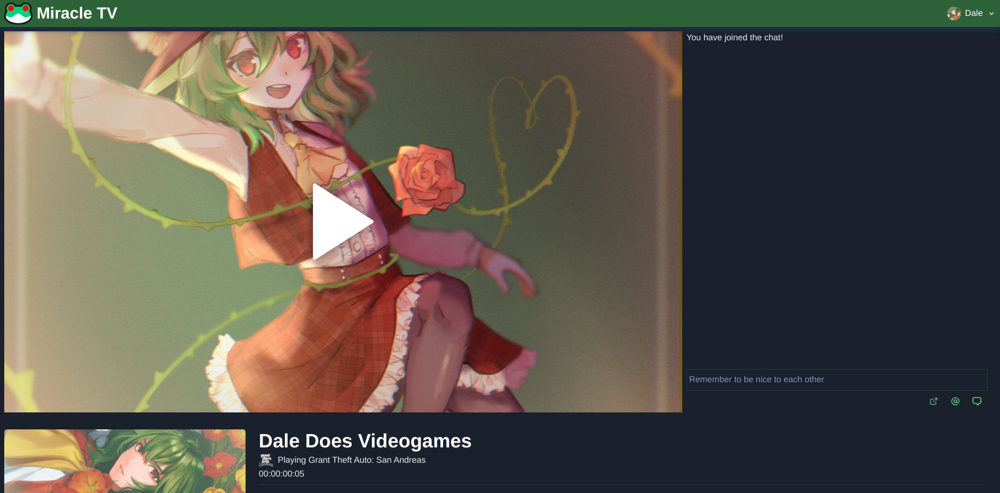

# MiracleTV

| Example screenshots                                         |
| ----------------------------------------------------------- | ----------------------------------------------------------- |
|  |  |
|  |  |

### An open-source Livestreaming Suite

MiracleTV is a "batteries-included" Open-source Live Streaming suite, featuring fully-functional multi-user environment, with support for mulitple channels per user, password-protected streams, content-warnings for streams and multiple streaming backend support

It is easy to deploy and manage with Docker-compose.

## Deploying to production

### !Warning! This software is not yet fully ready for production and provided as-is, with no warranty implied or otherwise.

In order to deploy this to production, please dowload or clone our repository, then simply do `$ docker-compose up -d`
You will have to make sure that ports 1935, 3333, 3478, 8082, 10000 are open on your system.
Forward proxy from your preferred domain to 1337 port on your system, and deployment is finished.

In order to make yourself an admin, create a user account and then execute `$ docker-compose run --rm miracle-backend yarn dev:ctl make-admin {username}` and follow on-screen instructions.

You may wish to modify `docker-compose.yml` file to adjust for data folders for your own system. Default folders in the file assume Ubuntu as the environment and existence of following dirs:

- `/home/ubuntu/miracle-data/media`
- `/home/ubuntu/miracle-data/streaming`
- `/home/ubuntu/miracle-data/db`

## Dev prerequisites

You need to have the latest version of `rethinkdb` installed on your system

## Setting up dev env with Nix

CD into the project directory, then execute `$ nix-shell` to drop into development environment.
Nix-shell will automatically execute yarn to make sure your packages are up to date.

## Setting up dev env with standard systems

CD into the project directory then execute `$ yarn`.

## Developing the app

### Starting the project

`$ yarn dev:both` will automatically start both frontend and backend in parallel so you can develop both at the same time.

### Generating GraphQL types and schema

If you had made any changes to the `src/server/graphql/schema/*.graphql` files, you should run `$ yarn codegen` in order to generate new typings to be used on client and server.
Additionally, if you have defined any new queries, mutations or fragments in the frontend side of the project using `gql\`\``template strings, you should run`$ yarn codgen` as well to generate new typings and hooks for the project.
